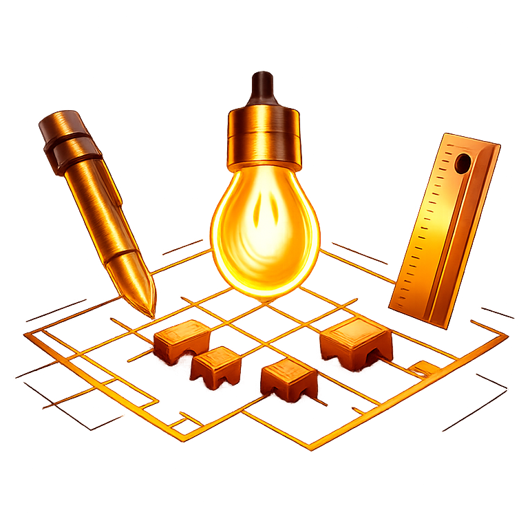

# LuxDraft

A professional 2D lighting design and analysis tool for architectural and theatrical applications. LuxDraft enables precise room layout creation, intelligent light fixture placement, and real-time photometric calculations with industry-standard IES data support.



## Features

### Room Design
- **Interactive Drawing Tools** - Create room layouts with walls, rafters, and architectural features
- **Snap-to-Grid System** - Precise positioning with intelligent snapping
- **Measurement Tools** - Real-time distance and dimension measurements
- **Undo/Redo History** - Full editing history with keyboard shortcuts

### Lighting Analysis
- **IES Photometric Support** - Import and parse industry-standard IES files
- **Real-time Calculations** - Accurate illuminance (lux) calculations using photometric principles
- **Visual Heatmaps** - Color-coded illumination visualization across the floor plan
- **Dead Zone Detection** - Identify under-lit areas below specified thresholds
- **Spacing Analysis** - Automatic detection of fixture spacing issues
- **Light Statistics** - Comprehensive metrics including average lux, uniformity ratios, and coverage

### Professional Tools
- **Custom Light Definitions** - Create and manage fixture libraries with lumen output and beam angles
- **Property Panel** - Edit fixture properties, positions, and photometric data
- **Multiple View Modes** - Switch between design and analysis views
- **Auto-save** - Automatic persistence to browser local storage
- **Theme Support** - Dark and light theme options

## Tech Stack

- **[Svelte 5](https://svelte.dev/)** - Reactive UI framework with the latest runes API
- **[Three.js](https://threejs.org/)** - 3D graphics for rendering and calculations
- **[TypeScript](https://www.typescriptlang.org/)** - Type-safe development
- **[Vite](https://vitejs.dev/)** (Rolldown) - Fast build tooling with Rolldown bundler
- **[Vitest](https://vitest.dev/)** - Unit testing framework

## Getting Started

### Prerequisites
- Node.js (v18 or higher recommended)
- npm or yarn package manager

### Installation

```bash
# Clone the repository
git clone <repository-url>
cd lumen_2d

# Install dependencies
npm install
```

### Development

```bash
# Start development server
npm run dev
```

Open your browser to `http://localhost:5173` to start designing.

### Building for Production

```bash
# Build optimized production bundle
npm run build

# Preview production build
npm run preview
```

### Testing

```bash
# Run tests in watch mode
npm test

# Run tests once
npm run test:run
```

## Usage

### Keyboard Shortcuts

| Key | Action |
|-----|--------|
| `D` | Switch to Draw mode |
| `V` | Switch to Select mode |
| `L` | Switch to Light placement mode / Set manual length (in draw mode) |
| `M` | Toggle measurement tool |
| `S` | Toggle grid snap |
| `Esc` | Cancel current operation / Clear measurement |
| `Ctrl+Z` | Undo |
| `Ctrl+Y` / `Ctrl+Shift+Z` | Redo |

### Drawing a Room

1. Press `D` to enter Draw mode
2. Click to place wall points
3. Press `L` to manually enter wall lengths
4. Complete the room by connecting back to the start point

### Placing Lights

1. Press `L` to enter Light placement mode
2. Click to place fixtures
3. Use the Property Panel to adjust:
   - Lumen output
   - Beam angle
   - Ceiling height
   - Fixture names

### Analyzing Lighting

1. Open the Lighting Stats panel to view:
   - Average illuminance (lux)
   - Minimum/maximum lux values
   - Uniformity ratios
   - Coverage percentage
2. Enable heatmap view to visualize light distribution
3. Configure dead zone thresholds to identify under-lit areas
4. Review spacing warnings for fixture placement issues

### Importing IES Files

LuxDraft supports industry-standard IES photometric data files:

1. Open the Light Definition Manager
2. Click "Import IES File"
3. Select your `.ies` file
4. The parser extracts lumen values and calculates beam angles automatically

## Project Structure

```
lumen_2d/
├── src/
│   ├── components/        # Svelte UI components
│   │   ├── Canvas.svelte
│   │   ├── Toolbar.svelte
│   │   ├── PropertyPanel.svelte
│   │   └── ...
│   ├── core/             # Core engine classes
│   │   ├── Scene.ts
│   │   ├── InputManager.ts
│   │   └── UnitConverter.ts
│   ├── geometry/         # Geometric utilities
│   │   ├── WallBuilder.ts
│   │   ├── SnapEngine.ts
│   │   └── PolygonValidator.ts
│   ├── lighting/         # Lighting calculations
│   │   ├── LightCalculator.ts
│   │   ├── IESParser.ts
│   │   ├── LightManager.ts
│   │   └── SpacingAnalyzer.ts
│   ├── rendering/        # Rendering systems
│   │   ├── EditorRenderer.ts
│   │   ├── HeatmapRenderer.ts
│   │   ├── ShadowRenderer.ts
│   │   └── shaders/
│   ├── stores/           # Svelte stores (state management)
│   ├── interactions/     # User interaction handlers
│   ├── persistence/      # Save/load functionality
│   └── types/           # TypeScript type definitions
├── public/              # Static assets
└── package.json
```

## Photometric Calculations

LuxDraft implements physically-based lighting calculations:

- **Inverse Square Law** - Light intensity decreases with the square of distance
- **Lambert's Cosine Law** - Surface illumination based on angle of incidence
- **Beam Distribution** - Smooth falloff at beam edges using smoothstep interpolation
- **Solid Angle Conversion** - Accurate lumen-to-candela conversion for spotlights
- **Unit Conversion** - Proper handling of feet/meters for illuminance calculations

The rendering pipeline uses WebGL shaders for real-time visualization of complex lighting scenarios with multiple fixtures.

## Contributing

Contributions are welcome! Please ensure:

1. Code follows existing TypeScript patterns
2. Tests are added for new features
3. Commits follow conventional commit format
4. UI changes maintain design consistency

## License

[Add your license here]

## Acknowledgments

- IES file format specification from the Illuminating Engineering Society
- Three.js community for excellent 3D rendering tools
- Svelte team for the reactive framework

---

Built with precision for lighting designers, architects, and stage technicians.
